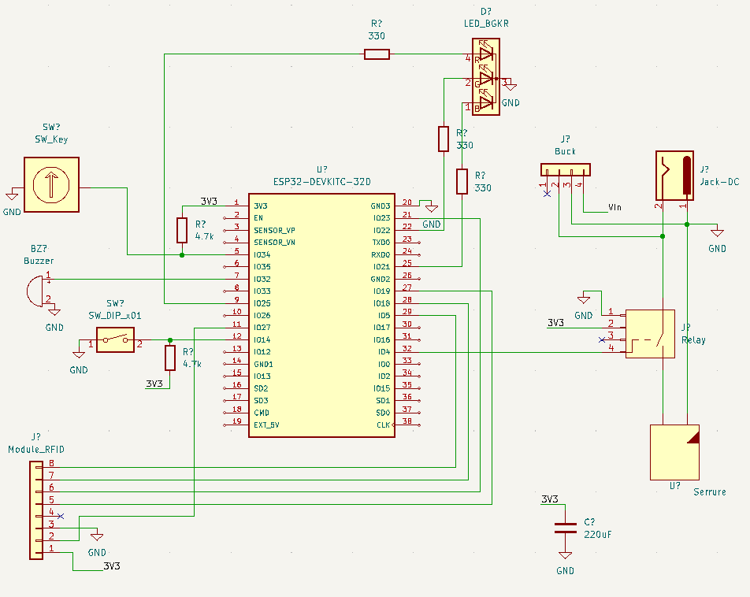

# We Will Lock You
## Serrure connectée

We Will Lock You est une serrure connectée pouvant être déverouillée à distance.
Cette serrure présente plusieurs fonctionalités:

- Ouverture de la serrure à distance au travers d'une interface web
- Ouverture de la serrure par badge RFID
- Ajout de badges RFID on the fly

### Matériel nécessaire

- Microcontrôleur ESP32
- Serrure solénoïde électrique DFRobot FIT0620
- Module RFID-RC522
- Relai HLS8L-DC3V-S-C
- Led RGB
- Buzzer
- Deux switchs
- Buck 12V to 5V, 2A (Pololu)
- Trois résistances (~ 300 Ω)
- Deux résistances (~ 4.7 kΩ)

Brancher les composants selon le schéma suivant :

Téléverser le code _Serrure_connectee.ino_ sur le microcontrôleur à l'aide de l'IDE Arduino (1.8.16) et d'un câble micro-USB
